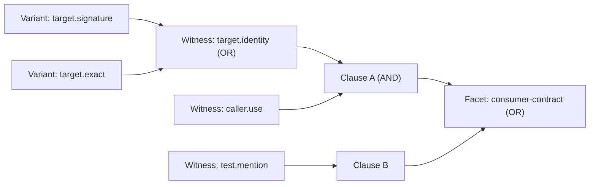
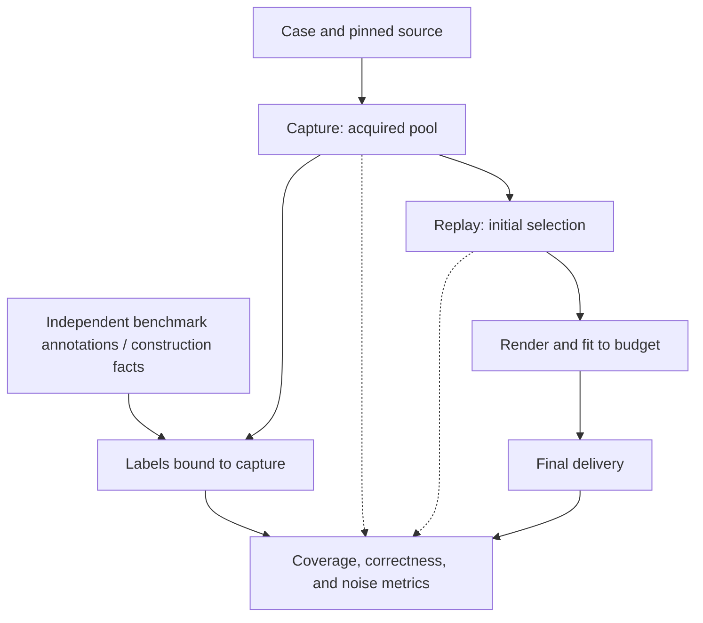

# Evaluating agentq

`evals` measures whether `agentq inspect` delivers the evidence a coding task needs within its output budget. It records evidence, replays inspection decisions, and checks the results against authored structural judgments or independently compiled benchmark labels.

The goals are to:

- Check correctness: source claims, requirements, and output limits must hold.
- Measure useful coverage and how much irrelevant or unjudged evidence reaches the output.
- Locate lost evidence in acquisition, selection, or final output fitting, and compare changes reproducibly.

This is developer tooling, separate from the installed `agentq` runtime. Its results measure evidence delivery; downstream coding success requires a separate evaluation.

## Scenarios

The evaluation uses three kinds of cases:

| Cases | Purpose |
| --- | --- |
| [Synthetic fixtures](fixtures/synthetic/) | Isolate selection rules and boundary conditions using small, authored evidence pools. |
| [Local repository fixtures](fixtures/repositories/) | Exercise real adapters against controlled source, including symbol resolution and evidence acquisition. |
| [External repository cases](cases/external/) | Exercise Python and TypeScript repositories at pinned commits using requests derived from annotated coding tasks. |

The [smoke suite](suites/smoke-v1.json) contains eight synthetic scenarios:

| Scenario | What it checks |
| --- | --- |
| `basic-edit` | Editable source, target identity, caller or test context, and package ownership. |
| `lexical-decoy` | Competition between useful evidence and irrelevant text matches. |
| `same-file-quota` | Diversity when several candidates come from the same file. |
| `variant-fallback` | Using a smaller representation when the full source does not fit. |
| `required-upgrade` | Upgrading an existing representation to satisfy more requirements without charging for both. |
| `empty-test-search` | Distinguishing a completed search with no tests from unavailable evidence. |
| `unstable-source` | Preventing exact-source claims when the underlying source has changed. |
| `delivery-overhead` | Accounting for output metadata when fitting the final result. |

External cases have two separate suites:

- **Source-conformance** requests the first annotated source span directly. It checks whether the requested source is delivered accurately.
- **Context-selection** resolves the changed symbol in its original file and collects evidence from its package. Every annotated span is compiled into independent coverage labels after acquisition. Spans outside the acquired pool remain in the denominator.

Suite locks declare `conformance`, `stress`, `natural`, or `transfer`. Experiments reject mixed tracks or objectives. ContextBench context-selection belongs to **transfer**: requests use a patch-identified symbol anchor, while task descriptions and supporting annotations stay outside acquisition. Patches are never applied. The scorer receives the native target-and-intent contract, so overlap with task-conditioned labels is a transfer diagnostic, not a native-intent quality claim.

[Generated repositories](generated.py) form a separate native structural stress suite. Twelve construction families specify source, binding use sites, same-name nonreferences, test locations, and source sizes before running real providers. Expected facts come from the construction; missing provider evidence remains missing. Existing synthetic fixtures cover alternate representations, missing providers, unstable evidence, and tight delivery boundaries.

[RepoBench](repobench.py) adds supplied-corpus completion transfer. The adapter deterministically shuffles candidates and keeps `next_line` and `gold_snippet_index` outside the decision input. Snippets have unknown binding and source coordinates; relevance never fabricates resolved references. Unlabeled snippets remain unjudged.

## Terminology

| Term | Meaning |
| --- | --- |
| **Capture** | An immutable record of an inspection request and its acquired evidence, including source versions and provider provenance. Replays use this same input. |
| **Observation / variant** | An observation is an acquired fact, such as a declaration or reference. A variant is one representation of it, such as a signature, excerpt, or exact source. |
| **Judgment** | A reviewer's rubric for one capture: evidence requirements, acceptable variants, explicitly irrelevant variants, and expected outcomes. |
| **Witness** | A named evidence criterion satisfied by any one of its acceptable variants: **OR**. |
| **Clause** | A set of witnesses that must all be satisfied together: **AND**. Each entry in a facet's `witness_sets` is a clause. |
| **Facet** | One graded evidence requirement, satisfied by any one of its clauses: **OR**. Facets marked `critical` contribute to the primary coverage metrics. |

For example, the [basic-edit judgment](fixtures/synthetic/judgments/basic-edit.json) defines `consumer-contract` as either caller evidence together with target identity, or test evidence. Target identity accepts either a signature or exact source.



Reviewers use readable variant aliases. [Judgment compilation](judgments.py) resolves them to immutable IDs from the exact capture, so labels cannot silently follow changed evidence. Evidence without a label receives no coverage credit and is tracked separately from evidence explicitly judged irrelevant.

## Methodology

### 1. Define the cases and splits

Choose the request, repository commit or fixture, and evidence requirements for each case. Development cases are used to fit candidates, validation cases to choose one, and holdout cases for the final frozen comparison. Keep related repository or fork cases in the same split. Every experimental case needs an explicit split; missing assignments fail. Full canonical `owner/repository` identities replace basename grouping. A declared fork-alias map merges known forks, and original task identities deduplicate imports. Alias maps must reflect known lineage; distinct owner/repository strings alone are not proof of independence. Stable family hashing prevents appended cases from reshuffling old partitions. Previously inspected ContextBench families are excluded from the new confirmatory cohort.

### 2. Capture the available evidence

Use `build-fixtures` for synthetic cases or `capture` for repository cases. Repository capture runs the real adapters on a clean checkout at the pinned commit and records the acquired pool, capabilities, and provenance. Failed or ambiguous resolutions remain recorded attempts and do not produce replayable captures.

### 3. Compile and lock the labels

For ContextBench, `import-rows` emits label sidecars preserving all annotated spans, source revision, and original task identity. `capture --labels-dir` validates their coordinates against the pinned checkout after ordinary acquisition and binds them to the capture. Automatic annotation coverage does not turn every span into a critical facet or label unannotated material irrelevant. Malformed rows, source mismatches, and unresolved anchors have explicit exclusion or attempt reasons.

Authored witnesses remain useful for mechanism tests. Generated structural cases compile their construction facts automatically. Suite locks fix case membership, capture IDs, judgment IDs, track, family, original identity, and any boundary budgets. Freezing requires every case to have labels and family/task identity.

### 4. Replay and evaluate each stage

Replay scoring, selection, and delivery profiles against the recorded pool without calling providers again. Check facet coverage at acquisition, initial selection, and final delivery. This shows whether evidence was never acquired, lost during selection, or removed while fitting the rendered output.



The main measurements are:

| Measurement | Interpretation |
| --- | --- |
| Annotated context coverage | Union of annotated source lines, files touched, or labeled dependency documents present at each stage; acquisition misses remain in the denominator. |
| Critical-facet recall | Fraction of annotated critical facets satisfied by delivered evidence. |
| All-critical-present rate | Fraction of cases with every critical facet satisfied, among cases that have critical facets. |
| Noncritical coverage | Coverage of noncritical facets that the acquired pool could satisfy. |
| Irrelevant / unjudged delivery | Source characters explicitly judged irrelevant, and the share of delivered source characters without labels. |
| Correctness and expected outcomes | Output bounds, source stability, valid exact-source claims, and case-specific assertions. |

Output budgets remain character ceilings. Actual delivered text is also counted with the pinned evaluation-only tokenizer `tiktoken==0.12.0/cl100k_base`; the tokenizer identity is part of the metric fingerprint. Token counts describe that encoding, not every model's tokenizer.

### 5. Compare candidate changes

Fit scoring coefficients on development cases with `tune-scoring`. Use `matrix` to compare the supplied candidates:

| Cell | Scoring | Selection |
| --- | --- | --- |
| Baseline | Current | Current |
| A | Tuned | Current |
| B | Current | Challenger |
| C | Tuned | Challenger |

The default `--budget-mode absolute` uses exactly 6,000, 12,000, and 24,000 characters; 12,000 is primary. It rejects case overrides. `--budget-mode boundary` requires every case to pin its ceiling and evaluates it once; `budget: 0` denotes the absence of a nominal absolute budget. Reports retain every actual ceiling. Keep boundary and absolute reports separate.

Every matrix runs specified [instrument checks](instruments.py). Under a 900-character scarcity budget, disabling reservation must lose required source, a decoy-preferring selection must deliver a known negative, and an empty selector must lose coverage honestly. Forged exact-source satisfaction and unstable delivery must fail correctness gates.

Candidates must pass correctness and expected-outcome checks on development and validation at every budget, without increasing known-negative delivery or the unjudged share. Aggregate rendered characters and actual tokens may grow by at most 10% relative to baseline. These are guardrails alongside coverage, so returning nothing earns no quality credit.

Nomination uses primary-budget validation coverage for the declared objective: facet coverage for native suites, annotated lines then files for ContextBench transfer, or labeled dependency documents for RepoBench. Development breaks ties; ties retain baseline. Freezing requires judged validation results and verifies exact development/validation membership. A development-only exploratory matrix cannot be frozen.

### 6. Freeze the experiment

Freeze the nominee, baseline, budgets, splits, promotion rule, and exact corpus membership before inspecting holdout results. The v3 manifest also binds inspection and core source code, evaluation code, tokenizer configuration, captures, and judgments. A report computed before an implementation edit must be rerun before freezing. The [confirmatory protocol](manifests/confirmatory-v3.json) declares the new experiment before holdout evaluation.

Changing any frozen input requires a fresh experiment. Code fingerprints are cached per process, so restart the command after edits.

### 7. Check the holdout

Run `holdout` against the frozen manifest. It rejects changed experiment inputs and compares the nominee with the baseline on held-out cases.

Both must be free of failures, correctness violations, and unmet expected outcomes at every declared budget. The nominee must satisfy the same negative, unjudged, and cost guardrails at every budget. Primary-budget coverage must stay within the frozen regression margin, which defaults to zero. Promotion also requires at least 20 held-out cases and three declared repository groups. These are engineering floors, not statistical guarantees. Reports retain group counts and an equal-weight repository bootstrap interval; subgroups are descriptive, never used to retune the frozen nominee. The report records the promotion decision; it does not change the runtime configuration.

## Running locally

From this repository's `agentq/` directory:

```bash
uv sync --locked --group eval
uv run python -m evals smoke
```

The smoke command builds the eight synthetic captures, replays them, and prints an evaluation summary. After the tokenizer vocabulary has been cached, it makes no network, provider, or model calls and exits with status `2` if a correctness gate fails. Artifacts are written to `.agentq-eval/` at the repository root.

To run capture, replay, and evaluation as separate steps:

```bash
uv run python -m evals build-fixtures --suite smoke-v1 --store ../.agentq-eval
uv run python -m evals replay --suite ../.agentq-eval/suites/smoke-v1.lock.json \
  --profile evals/profiles/baseline.json --run-dir ../.agentq-eval/runs/baseline
uv run python -m evals evaluate --run-dir ../.agentq-eval/runs/baseline
```

Use a fresh run directory for each replay. The [CLI implementation](__main__.py) defines the experiment commands; [metrics.py](metrics.py) and [matrix.py](matrix.py) define the measurements and promotion checks.

### Building the automatic corpora

The downloads are pinned in source manifests. The existing ContextBench downloader fills the full dataset cache while retaining its historical eight-row development sample. Then compile the cached rows, build the sampled RepoBench captures, and run the real Python providers on generated repositories:

```bash
uv run --locked --group eval python scripts/download_contextbench_seed.py
uv run --locked --group eval python -m scripts.download_repobench
uv run --locked --group eval python -m scripts.build_evaluation_corpora \
  --store ../.agentq-eval/confirmatory-v3 --repobench-limit 240 --generated-seeds 1
```

Pass `--families aliases.json` to declare known fork lineages. The builder writes input-only sampling criteria, exact membership, source revisions, exclusions, and explicit splits before evaluating any outcomes. ContextBench cases and labels are import artifacts until their pinned repositories are fetched and captured. For those captures:

```bash
uv run --locked --group eval python -m evals fetch-checkouts \
  --store ../.agentq-eval/confirmatory-v3 \
  --cases-dir ../.agentq-eval/confirmatory-v3/corpora/contextbench/confirmation-cases
uv run --locked --group eval python -m evals capture \
  --store ../.agentq-eval/confirmatory-v3 --suite contextbench-transfer-v3 \
  --cases-dir ../.agentq-eval/confirmatory-v3/corpora/contextbench/confirmation-cases \
  --labels-dir ../.agentq-eval/confirmatory-v3/corpora/contextbench/labels
```

RepoBench and generated locks are directly replayable. Fit scoring on development, then nominate and freeze using validation:

```bash
uv run --locked --group eval python -m evals tune-scoring \
  --store ../.agentq-eval/confirmatory-v3 \
  --suite ../.agentq-eval/confirmatory-v3/suites/repobench-transfer-v1.lock.json \
  --splits ../.agentq-eval/confirmatory-v3/repobench-splits.json \
  --out ../.agentq-eval/confirmatory-v3/experiments/tuned.json
uv run --locked --group eval python -m evals matrix \
  --store ../.agentq-eval/confirmatory-v3 \
  --suite ../.agentq-eval/confirmatory-v3/suites/repobench-transfer-v1.lock.json \
  --splits ../.agentq-eval/confirmatory-v3/repobench-splits.json \
  --selection evals/profiles/selection-challenger.json --freeze \
  --frozen-profile ../.agentq-eval/confirmatory-v3/experiments/frozen-profile.json
```

If tuning writes a changed scorer, pass its path to `matrix --scoring`. Ties leave the scorer unchanged and write no profile. The matrix does not evaluate held-out outcomes; `holdout` is a separate explicit command. Old frozen manifests and previously inspected holdout cases are not relabeled as a new unseen experiment.
