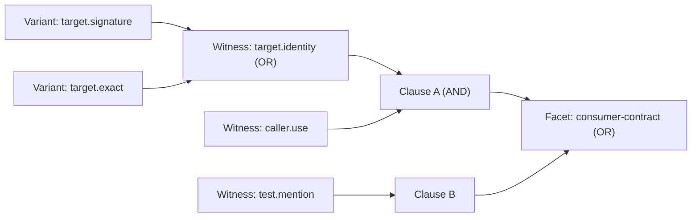
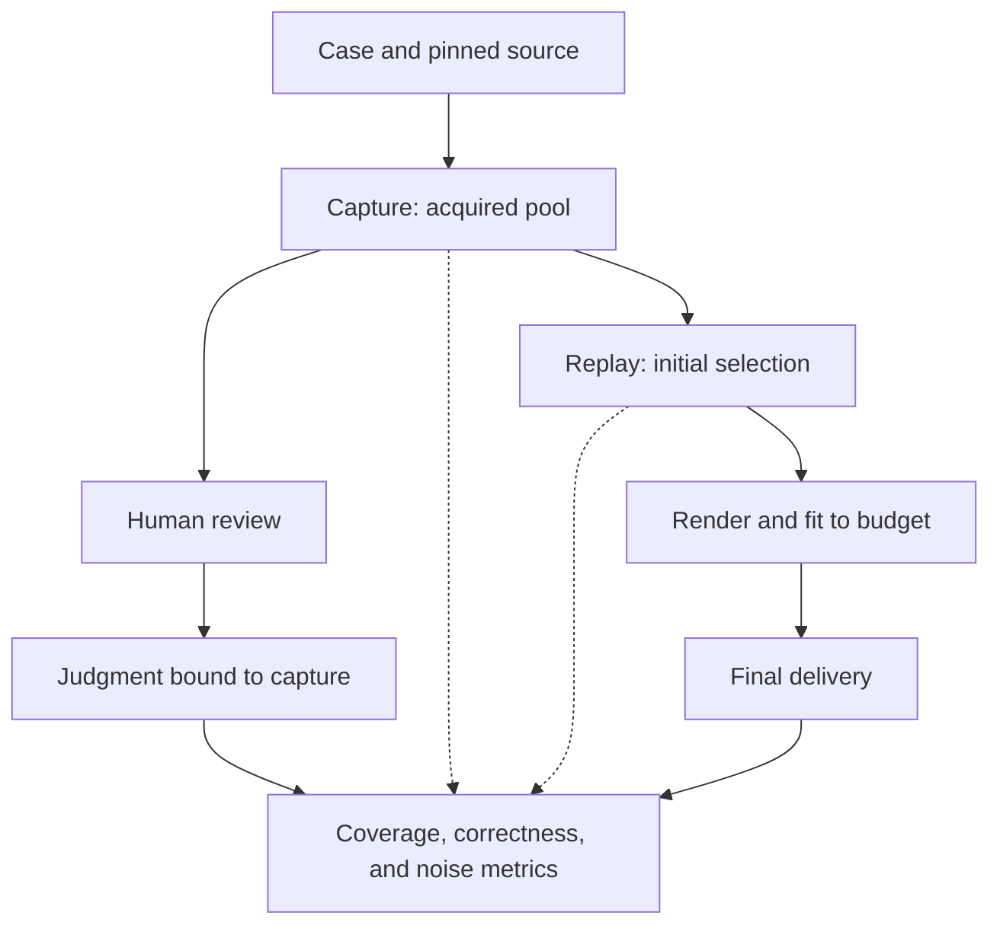

# Evaluating agentq

`evals` measures whether `agentq inspect` delivers the evidence a coding task needs within its output budget. It records evidence, replays inspection decisions, and checks the results against human-authored judgments.

The goals are to:

- Check correctness: source claims, requirements, and output limits must hold.
- Measure useful coverage and how much irrelevant or unjudged evidence reaches the output.
- Locate lost evidence in acquisition, selection, or final output fitting, and compare changes reproducibly.

This is developer tooling, separate from the installed `agentq` runtime. Its results measure evidence delivery; downstream coding success requires a separate evaluation.

## Scenarios

The evaluation uses three kinds of cases:

| Cases | Purpose |
| --- | --- |
| [Synthetic fixtures](fixtures/synthetic/) | Isolate selection rules and boundary conditions using small, authored evidence pools. |
| [Local repository fixtures](fixtures/repositories/) | Exercise real adapters against controlled source, including symbol resolution and evidence acquisition. |
| [External repository cases](cases/external/) | Exercise Python and TypeScript repositories at pinned commits using requests derived from annotated coding tasks. |

The [smoke suite](suites/smoke-v1.json) contains eight synthetic scenarios:

| Scenario | What it checks |
| --- | --- |
| `basic-edit` | Editable source, target identity, caller or test context, and package ownership. |
| `lexical-decoy` | Competition between useful evidence and irrelevant text matches. |
| `same-file-quota` | Diversity when several candidates come from the same file. |
| `variant-fallback` | Using a smaller representation when the full source does not fit. |
| `required-upgrade` | Upgrading an existing representation to satisfy more requirements without charging for both. |
| `empty-test-search` | Distinguishing a completed search with no tests from unavailable evidence. |
| `unstable-source` | Preventing exact-source claims when the underlying source has changed. |
| `delivery-overhead` | Accounting for output metadata when fitting the final result. |

External cases have two separate suites:

- **Source-conformance** requests the first annotated source span directly. It checks whether the requested source is delivered accurately.
- **Context-selection** resolves the changed symbol in its original file and collects evidence from its package. Reviewers judge which competing references, mentions, and source representations provide useful context.

Capture, split, and report these suites separately: they measure different questions. Patches, task descriptions, and remaining annotated spans are review inputs; patches are never applied to the captured checkout. Context-selection cases need reviewed judgments before they can contribute to tuning or evaluation.

## Terminology

| Term | Meaning |
| --- | --- |
| **Capture** | An immutable record of an inspection request and its acquired evidence, including source versions and provider provenance. Replays use this same input. |
| **Observation / variant** | An observation is an acquired fact, such as a declaration or reference. A variant is one representation of it, such as a signature, excerpt, or exact source. |
| **Judgment** | A reviewer's rubric for one capture: evidence requirements, acceptable variants, explicitly irrelevant variants, and expected outcomes. |
| **Witness** | A named evidence criterion satisfied by any one of its acceptable variants: **OR**. |
| **Clause** | A set of witnesses that must all be satisfied together: **AND**. Each entry in a facet's `witness_sets` is a clause. |
| **Facet** | One graded evidence requirement, satisfied by any one of its clauses: **OR**. Facets marked `critical` contribute to the primary coverage metrics. |

For example, the [basic-edit judgment](fixtures/synthetic/judgments/basic-edit.json) defines `consumer-contract` as either caller evidence together with target identity, or test evidence. Target identity accepts either a signature or exact source.



Reviewers use readable variant aliases. [Judgment compilation](judgments.py) resolves them to immutable IDs from the exact capture, so labels cannot silently follow changed evidence. Evidence without a label receives no coverage credit and is tracked separately from evidence explicitly judged irrelevant.

## Methodology

### 1. Define the cases and splits

Choose the request, repository commit or fixture, and evidence requirements for each case. Development cases are used to fit candidates, validation cases to choose one, and holdout cases for the final frozen comparison. Keep related repository or fork cases in the same split. Use explicit split assignments for experiments: unlisted cases default to development.

### 2. Capture the available evidence

Use `build-fixtures` for synthetic cases or `capture` for repository cases. Repository capture runs the real adapters on a clean checkout at the pinned commit and records the acquired pool, capabilities, and provenance. Failed or ambiguous resolutions remain recorded attempts and do not produce replayable captures.

### 3. Review and lock the judgments

Inspect the captured variants and their source, then author the judgment's facets, witnesses, irrelevant labels, and expected outcomes. Compile the judgment against that capture. A suite lock fixes the case membership, capture IDs, judgment IDs, and any case-specific output budgets; cases without judgments are excluded from scoring experiments.

### 4. Replay and evaluate each stage

Replay scoring, selection, and delivery profiles against the recorded pool without calling providers again. Check facet coverage at acquisition, initial selection, and final delivery. This shows whether evidence was never acquired, lost during selection, or removed while fitting the rendered output.



The main measurements are:

| Measurement | Interpretation |
| --- | --- |
| Critical-facet recall | Fraction of annotated critical facets satisfied by delivered evidence. |
| All-critical-present rate | Fraction of cases with every critical facet satisfied, among cases that have critical facets. |
| Noncritical coverage | Coverage of noncritical facets that the acquired pool could satisfy. |
| Irrelevant / unjudged delivery | Source characters explicitly judged irrelevant, and the share of delivered source characters without labels. |
| Correctness and expected outcomes | Output bounds, source stability, valid exact-source claims, and case-specific assertions. |

Output budgets are measured in characters. Any reported token count is an estimate of one token per four rendered characters, rounded up.

### 5. Compare candidate changes

Fit scoring coefficients on development cases with `tune-scoring`. Use `matrix` to compare the supplied candidates:

| Cell | Scoring | Selection |
| --- | --- | --- |
| Baseline | Current | Current |
| A | Tuned | Current |
| B | Current | Challenger |
| C | Tuned | Challenger |

The standard budgets are 6,000, 12,000, and 24,000 characters; 12,000 is primary. A case with a pinned budget retains it across the matrix, preserving its boundary condition.

Candidates must pass correctness and expected-outcome checks on development and validation at every budget, without increasing irrelevant delivery or the unjudged share relative to baseline. Nomination ranks eligible candidates by primary-budget validation coverage: critical facets, then cases with all critical facets, then noncritical facets. Development results break ties, or determine the choice when validation is absent.

### 6. Freeze the experiment

Freeze the nominee, baseline, budgets, splits, promotion rule, and exact corpus membership before inspecting holdout results. The manifest also binds inspection and core source code, evaluation code, metric configuration, captures, and judgments.

Changing any frozen input requires a fresh experiment. Code fingerprints are cached per process, so restart the command after edits.

### 7. Check the holdout

Run `holdout` against the frozen manifest. It rejects changed experiment inputs and compares the nominee with the baseline on held-out cases.

Both must be free of failures, correctness violations, and unmet expected outcomes at every declared budget. The nominee must not increase known-irrelevant delivery or the unjudged share at any budget. At the primary budget, critical-facet and all-critical-present counts must stay within the declared regression margin, which defaults to zero. The report records the promotion decision; it does not change the runtime configuration.

## Running locally

From this repository's `agentq/` directory:

```bash
uv sync
uv run python -m evals smoke
```

The smoke command builds the eight synthetic captures, replays them, and prints an evaluation summary. It makes no network, provider, or model calls and exits with status `2` if a correctness gate fails. Artifacts are written to `.agentq-eval/` at the repository root.

To run capture, replay, and evaluation as separate steps:

```bash
uv run python -m evals build-fixtures --suite smoke-v1 --store ../.agentq-eval
uv run python -m evals replay --suite ../.agentq-eval/suites/smoke-v1.lock.json \
  --profile evals/profiles/baseline.json --run-dir ../.agentq-eval/runs/baseline
uv run python -m evals evaluate --run-dir ../.agentq-eval/runs/baseline
```

Use a fresh run directory for each replay. The [CLI implementation](__main__.py) defines the experiment commands; [metrics.py](metrics.py) and [matrix.py](matrix.py) define the measurements and promotion checks.
